# Manual de usuario

*Revisado el 01-10-2026.*

Tres partes:

- **A**, para quien sigue la clase: Colab, Claude y Posit Cloud, sin instalar nada.
- **B**, para quien usa el programa `cryptoquant` en su propio equipo.
- **C**, para publicar el piloto de riesgo en internet con Docker y DigitalOcean.

Las capturas del piloto usan una cartera inventada (0,05 BTC, 1,2 ETH, 10 SOL y 500 USDT) con los
precios del 01-10-2026.

> Esto es software de análisis estadístico, no asesoramiento financiero. Sus salidas son
> estimaciones con error. En cripto, perderlo todo es un desenlace posible.

---

# Parte A · Para el alumno

## A.1 Lo que necesitas

| Herramienta | Para qué | Cuenta |
|---|---|---|
| Google Colab | Ejecutar Python en el navegador | Tu cuenta de Google |
| claude.ai | Pedir el código | Cuenta gratuita en <https://claude.ai> |
| Posit Cloud | Ejecutar R en el navegador (desde la sesión 2) | Cuenta gratuita en <https://posit.cloud> |

Una computadora con Chrome o Edge. No hace falta instalar nada.

## A.2 El cuaderno de la clase en Colab

1. **Abrir.** Entra al enlace de `alumno.ipynb` que comparte el docente.
2. **Guardar tu copia.** Archivo › Guardar una copia en Drive. Trabaja siempre en tu copia: el
   original es de solo lectura y lo que escribas en él se pierde.
3. **Ejecutar una celda.** Haz clic en ella y pulsa **Shift + Enter**, o el botón ▶ de su izquierda.
4. **La celda Preparación.** Es la primera. Ejecútala una sola vez al empezar y no la cambies:
   carga los verificadores. Responde `Listo. Ya puedes seguir con el Bloque 1.`
5. **Cada bloque** tiene tres partes:
   - un **prompt** en un recuadro gris: cópialo y pégalo en Claude;
   - una celda **Pega aquí**: pega el código que te dio Claude y ejecútala;
   - una celda **verificar**: ejecútala al final. Responde `[OK]` si todo está bien, o
     `[REVISAR]` con lo que hay que pedirle a Claude.
6. **Archivos.** El icono de carpeta de la izquierda abre el panel de archivos. Para subir un CSV,
   arrástralo ahí. Para descargar uno, clic derecho › Descargar.

Así empieza el Bloque 1. El *prompt* es el recuadro gris de abajo:

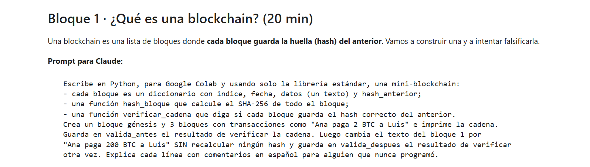

Después de pegar el código de Claude y ejecutarlo, la celda **verificar** dice si está bien:

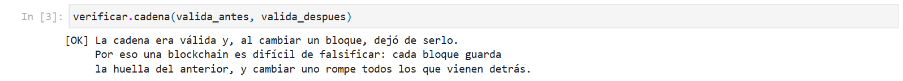

O qué revisar, y qué pedirle a Claude:

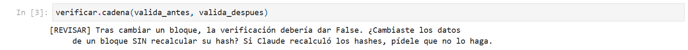

Estas tres vistas son del cuaderno abierto fuera de Colab. En Colab cambia el marco de la pantalla,
no el contenido ni las respuestas.

### Si algo falla en Colab

| Lo que ves | Qué significa | Qué hacer |
|---|---|---|
| `[REVISAR] Python no conoce «df»` | No se ejecutó la celda que crea `df`, o Claude usó otro nombre | Ejecuta la celda del código; si ya lo hiciste, pide a Claude el nombre exacto que dice el prompt |
| Error 451 al descargar | El código usa `api.binance.com`, que bloquea los servidores de Colab | Pide a Claude que use `data-api.binance.vision` |
| La descarga no funciona por otra razón | Problema de red | Celda **PLAN B**: sube `BTCUSDT_1d.csv` de la carpeta de Drive y quita los `#` |
| «Se reinició el entorno de ejecución» o todo dice que no existe | Colab borró la memoria (por inactividad o por un reinicio) | Vuelve a ejecutar la celda Preparación y las celdas anteriores, en orden |
| Un error largo en inglés | El código de Claude tiene un fallo | Cópialo entero y pégaselo a Claude (prompt de rescate de abajo) |

## A.3 Cómo pedirle código a Claude

- Pega el prompt del cuaderno tal cual: fija los nombres de las variables (`df`, `vol_anual`,
  `exactitud_modelo`…) que buscan los verificadores.
- Si no entiendes una línea, pregunta: «explícame esta línea como si nunca hubiera programado».
- Prompts de rescate:

```text
Me salió este error en Google Colab al ejecutar tu código. Explícame en una frase qué significa
y dame el código corregido completo: [pega aquí el error entero]
```

```text
El verificador de mi clase dice: [pega el mensaje de REVISAR]. Corrige el código para que lo cumpla
y explícame qué estaba mal.
```

```text
Revisa este código como un profesor exigente: ¿usa en algún momento información del futuro para
predecir el pasado? Señala la línea exacta si es así. [pega el código]
```

- La cuenta gratuita tiene un límite de mensajes. Si lo alcanzas, trabaja en pareja: el
  verificador funciona igual con el código de otra persona.

## A.4 Posit Cloud (R)

1. Abre el proyecto de la clase que comparte el docente y guarda tu copia si te lo pide.
2. **Subir un archivo:** panel *Files* (abajo a la derecha) › *Upload*.
3. **Ejecutar:** abre `clase01.R`, pon el cursor en una línea y pulsa **Ctrl + Enter**; se ejecuta
   esa línea y el cursor baja a la siguiente. *Source* ejecuta el archivo entero.
4. Los resultados salen en la *Console* y los gráficos en la pestaña *Plots*.
5. Si falta un paquete: `install.packages("dplyr")` en la consola (tarda unos minutos).

`clase01.R` lee `BTCUSDT_1d.csv`; si no lo encuentra, lo descarga solo. En ambos casos usa los datos
desde el 01-01-2023, para que las cifras coincidan con las de Python. Su primer gráfico, en la
pestaña *Plots*, es este:

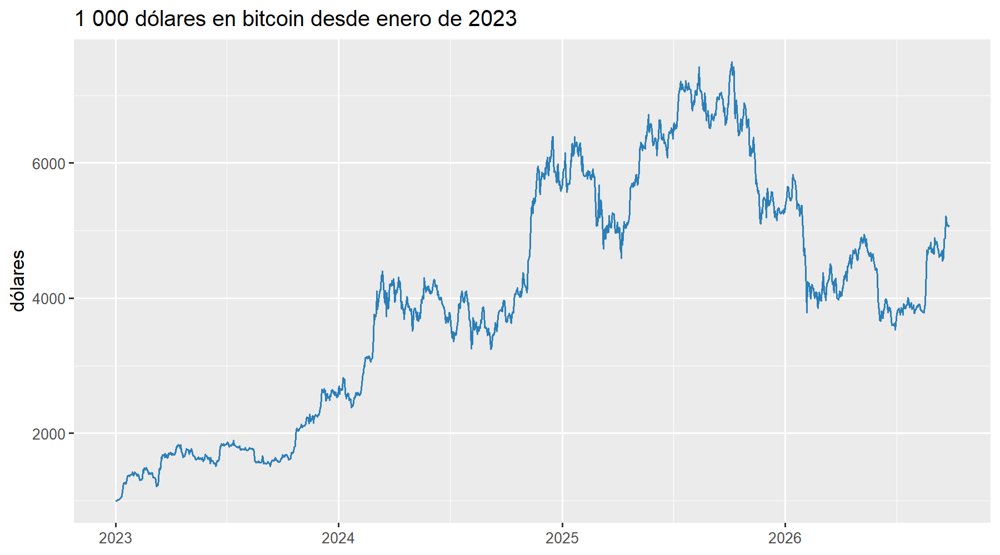

---

# Parte B · Para el docente: el programa `cryptoquant`

`cryptoquant` es el sistema que hay detrás del curso y de la tesis: descarga precios de Binance,
mide el riesgo, controla la volatilidad y deja cada resultado en tablas y gráficos. Se usa desde
la consola con `python -m cryptoquant <comando>`. Su diseño está en
`08_arquitectura_del_programa.md`.

## B.1 Instalación

### Python

Requiere Python 3.10 o superior. Desde la raíz del repositorio:

```bash
python -m venv .venv
.venv\Scripts\activate                 # Windows
pip install -r requirements.txt        # incluye Streamlit, para el piloto
pip install pytest nbformat ipython    # solo para pasar las pruebas
```

En el equipo del docente el entorno ya existe en `C:\Users\ADMIN\.venvs\cryptoquant`. Lo usan la tarea
programada del forward test, `scripts\sincronizar.ps1` y `scripts\piloto.cmd`. Para usarlo, se escribe su
`python.exe` delante de cada comando:

```powershell
C:\Users\ADMIN\.venvs\cryptoquant\Scripts\python.exe -m cryptoquant --help
```

Ese entorno necesita también las librerías de las pruebas (`pytest`, `nbformat` e `ipython`). Sin ellas,
las pruebas se detienen y `sincronizar.ps1 -Codigo` no lleva nada al PC (B.9).

### Para reproducir la tesis

Las cifras de la tesis se obtuvieron con Python 3.11.8 y las versiones exactas de `requirements-tesis.txt`:

```bash
pip install -r requirements-tesis.txt
```

Con otras versiones, el aprendizaje automático toma otras decisiones y las cifras cambian. Se nota en la
huella de los retornos (B.6), que deja de empezar por `f94f1571d68a`.

### R

R 4.x (probado con R 4.6.1) y RStudio, que hace falta para tejer los R Markdown. Los paquetes se
instalan una sola vez:

```r
install.packages(c("dplyr", "tidyr", "readr", "ggplot2", "lubridate", "zoo",
                   "forecast", "rugarch", "ranger", "tseries", "jsonlite", "rmarkdown"))
```

El instalador de R no lo añade al PATH de Windows. Desde una terminal, `Rscript` se escribe con su ruta
completa, o se añade `C:\Program Files\R\R-4.6.1\bin` al PATH:

```powershell
& "C:\Program Files\R\R-4.6.1\bin\Rscript.exe" tesis.R
```

### Comprobar que todo está bien

```bash
python -m cryptoquant --help
python -m pytest tests/ -q
```

En R, `09_instalacion/prueba_r.R` pegado en la consola de RStudio debe terminar con `TODO LISTO`.

## B.2 Comandos para preparar una clase

| Comando | Qué hace |
|---|---|
| `python -m cryptoquant paquete` | Descarga los CSV de respaldo (BTC, ETH y SOL; diarios desde 2020, horarios desde 2025) y escribe `LEEME.txt` con sus huellas SHA-256 |
| `python clase/01_primera_clase/generar_cuadernos.py` | Rehace `alumno.ipynb` y `docente.ipynb` desde su única fuente |
| `python -m pytest tests/test_clase.py -q` | Comprueba que los cuadernos están al día y que los verificadores detectan los errores típicos de la IA |

Opciones de `paquete`:

| Opción | Por defecto | Ejemplo |
|---|---|---|
| `--destino` | `clase/01_primera_clase/datos` | `--destino clase/sesion_1_2026-09-27/04_datos_respaldo` |
| `--simbolos` | `BTC,ETH,SOL` | `--simbolos BTC,ETH,SOL,BNB` |
| `--desde-diario` | `2020-01-01` | `--desde-diario 2022-01-01` |
| `--desde-horario` | `2025-01-01` | `--desde-horario 2026-01-01` |

Los cuadernos **no se editan a mano**: se cambia `generar_cuadernos.py` y se vuelve a ejecutar.
Si se cambia un prompt, hay que cambiarlo también en el plan de la clase.

## B.3 El laboratorio: de las velas al modelo

```bash
python -m cryptoquant laboratorio
```

Recorre los nueve pasos del temario sobre BTC/USDT y deja tablas (`*.csv`) y gráficos (`*.png`) en
`reports/laboratorio/`. La primera vez descarga unas 41 000 velas horarias (menos de un minuto).

| Opción | Por defecto | Para qué |
|---|---|---|
| `--simbolo` | `BTC` | Otro activo |
| `--temporalidad` | `1h` | `1h`, `4h` o `1d` |
| `--desde` | `2022-01-01` | Inicio de la muestra |
| `--descargar` | — | Forzar velas nuevas en lugar de reutilizar el CSV |
| `--acierto` | `0.45` | Monte Carlo de la cuenta: porcentaje de aciertos |
| `--rb` | `2.0` | Relación riesgo-beneficio 1:rb |
| `--riesgo` | `0.01` | Fracción de la cuenta arriesgada por operación |
| `--capital` | `10000` | Capital inicial de la simulación |
| `--objetivo` | `0.15` | Volatilidad objetivo del control de volatilidad |
| `--no-plots` | — | Sin gráficos |

La versión en R está en `laboratorio/r/laboratorio.Rmd`: se abre `laboratorio.Rproj` en RStudio y se
pulsa *Knit*. Lee el CSV que exporta Python; si no existe, descarga las velas él mismo. Compara sus
variables con las de Python, y la diferencia máxima debe ser cero o de redondeo. Deja `laboratorio.html`
junto al `.Rmd` y sus tablas en `reports/laboratorio/r/`.

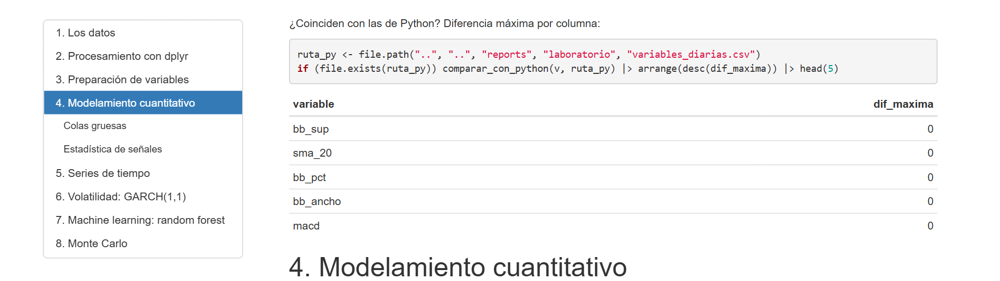

## B.4 Medir el riesgo

| Comando | Qué responde |
|---|---|
| `python -m cryptoquant riesgo` | VaR y CVaR del sistema, de la pasiva equiponderada y de todo en BTC, por cuatro métodos, y si cada método habría acertado (Kupiec y Christoffersen). Probabilidad de caídas a 1, 3 y 12 meses |
| `python -m cryptoquant cartera --tengo "BTC=0.05,ETH=1.2,USDT=500"` | Cuánto puede perder mañana esa cartera, el rango del próximo mes, qué activo aporta más riesgo, y el stop y el tamaño de una entrada nueva |
| `python -m cryptoquant evidencia` | Pasa las señales del laboratorio por el filtro de evidencia: fuera de muestra, al menos 30 eventos, corrección por comparaciones múltiples y después de costes |

Opciones útiles: `riesgo --capital 5000` (VaR en dinero), `cartera --confianza 0.99 --dias 30`,
`evidencia --registro` (ideas ya evaluadas).

Después de `riesgo`, `laboratorio/r/riesgo.Rmd` (*Knit* en RStudio) recalcula en R las pruebas de Kupiec y
Christoffersen y las compara con las de Python. Debe dar 0 excepciones distintas y 0 veredictos distintos.

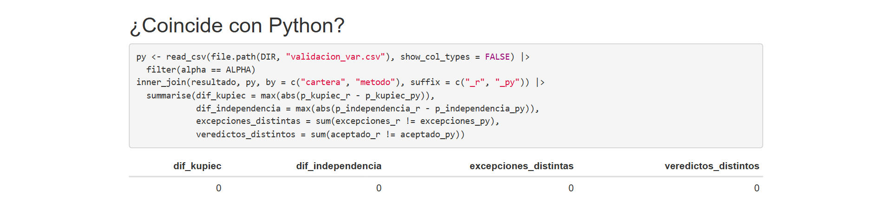

## B.5 Ver el estado y usar la cartera real

| Comando | Qué hace |
|---|---|
| `python -m cryptoquant dashboard --open` | Genera `reports/dashboard.html`, un panel que se abre con doble clic y sin conexión |
| `python -m cryptoquant piloto` | Abre en el navegador la app que dice cuánto tener en cripto con su cartera real para no pasar del riesgo elegido. Solo recomienda: no usa claves ni envía órdenes |
| `python -m cryptoquant piloto --texto` | El plan de hoy en la consola, sin abrir la app |
| `scripts\piloto.cmd` (doble clic) | Lo mismo que `piloto`. Usa el entorno de B.1 (`.venvs\cryptoquant` en la carpeta del usuario) o, si no existe, el `python` del sistema. Si algo falla, la ventana queda abierta con el mensaje |

El panel resume el sistema y el experimento en una sola página:

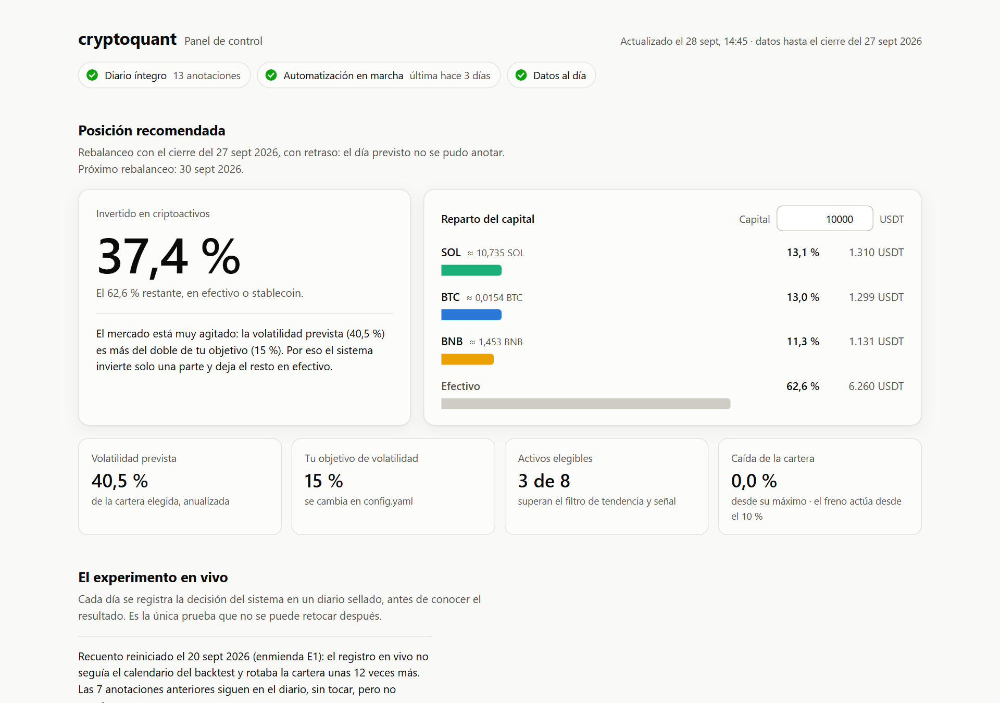

La app necesita Streamlit, que viene en `requirements.txt`. Si falta, `piloto` lo dice y muestra la orden
para instalarlo en ese mismo entorno; mientras tanto, `piloto --texto` funciona sin él.

### El piloto, pantalla por pantalla

**Al abrirlo.** A la izquierda, la barra lateral con su cartera y el riesgo que acepta. A la derecha,
cinco pestañas: *Hoy*, *Tiempos duros*, *La regla en el pasado*, *Mi diario* y *Cómo funciona*.

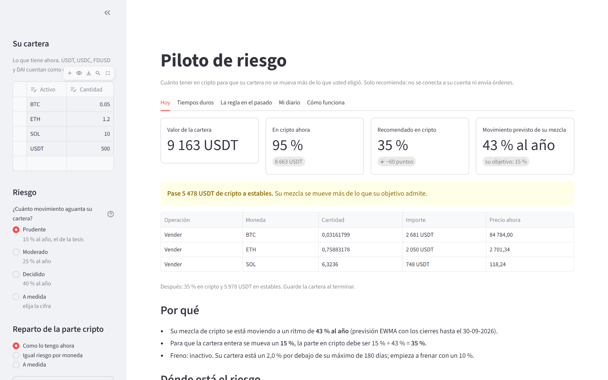

**La barra lateral.** Una fila por moneda, con la cantidad que tiene; USDT, USDC, FDUSD y DAI cuentan como
efectivo. Debajo se elige cuánto movimiento aguanta la cartera (*Prudente* es el 15 % al año de la tesis) y
cómo se reparte la parte cripto. *Más ajustes* abre el resto: el máximo en cripto, la banda para no operar,
el freno por caídas y la orden mínima.

**Guardar.** Lo que se cambia en la barra lateral no se guarda solo: el piloto avisa con *Hay cambios sin
guardar*. Se guarda cada vez que se compra, vende, ingresa o retira, para que el piloto mida bien la caída
de la cartera y el freno funcione.

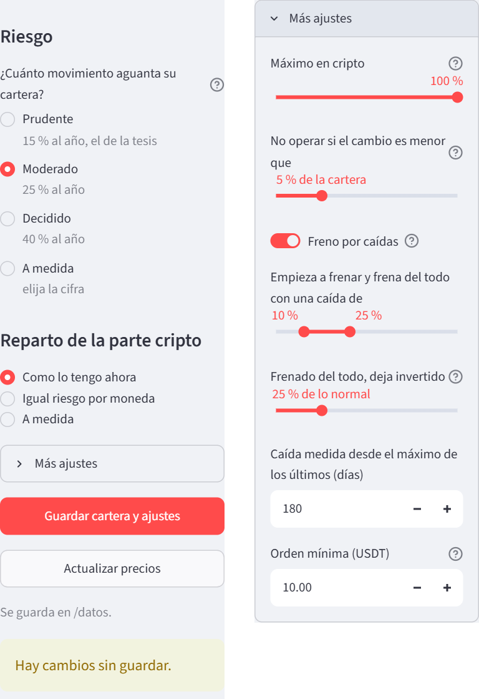

**Hoy.** Cuatro cifras: el valor de la cartera, cuánto hay en cripto, cuánto recomienda y cuánto se mueve
la mezcla. Debajo, la recomendación en un recuadro de color y las órdenes concretas. Después, *Por qué*
explica la cuenta, y *Dónde está el riesgo* compara el peso de cada moneda en dinero y en riesgo.

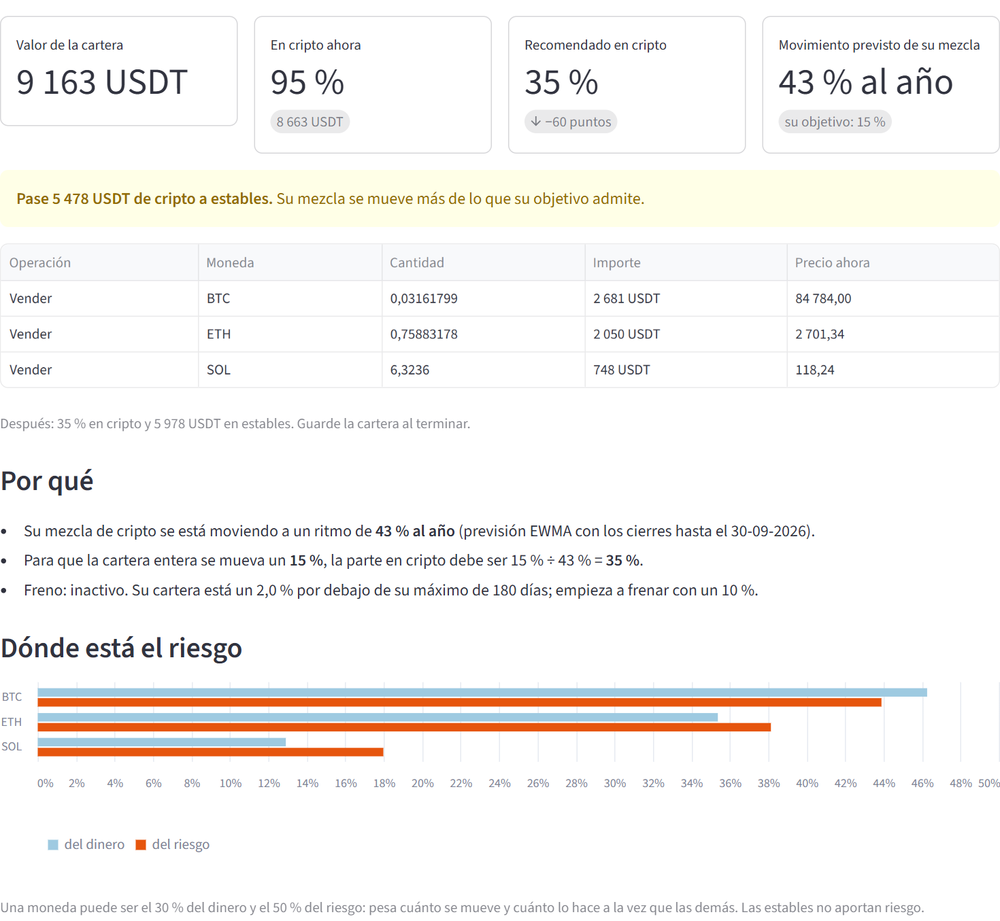

**Tiempos duros.** Qué se perdería si se repitiera lo peor desde 2020, con la cartera de hoy y siguiendo la
recomendación, y el riesgo de un mal día y del próximo mes. El botón contrasta el mal día con los cuatro
métodos de VaR validados y dice si cada uno habría acertado con esta cartera.

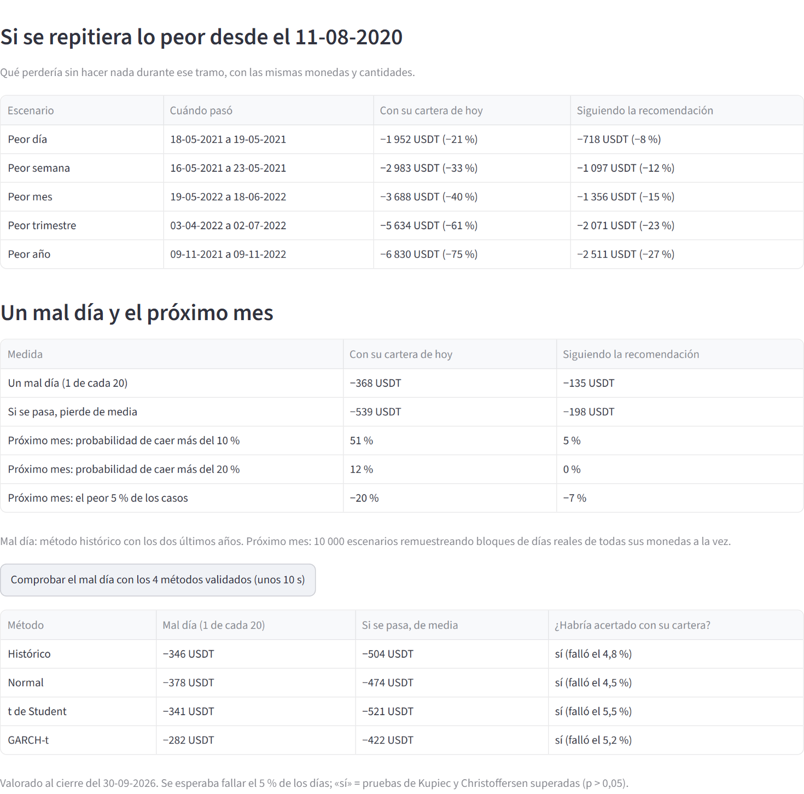

**La regla en el pasado.** Qué habría pasado desde 2020 con este reparto y estos ajustes. Se compara con
*Comprar y mantener* y con *Mantener a igual volatilidad*, que es la comparación justa.

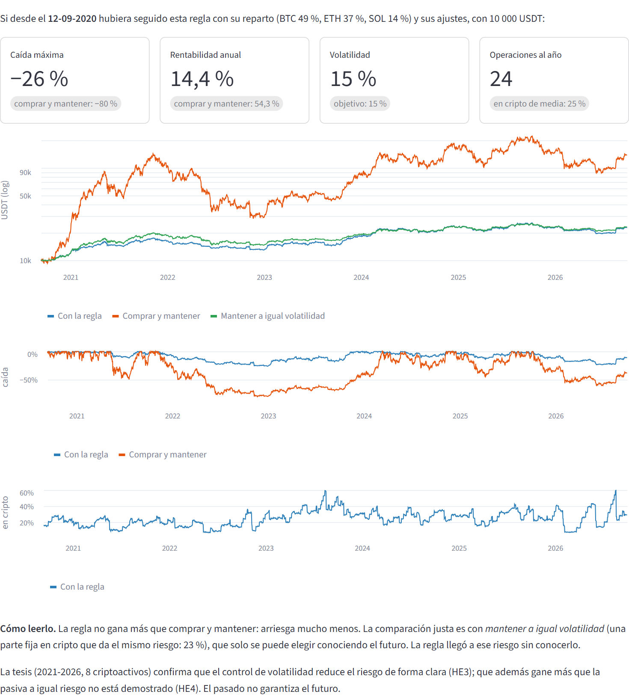

**Mi diario.** El valor de la cartera desde la primera vez que se guardó, sin contar ingresos ni retiros, y
la lista de fotos guardadas.

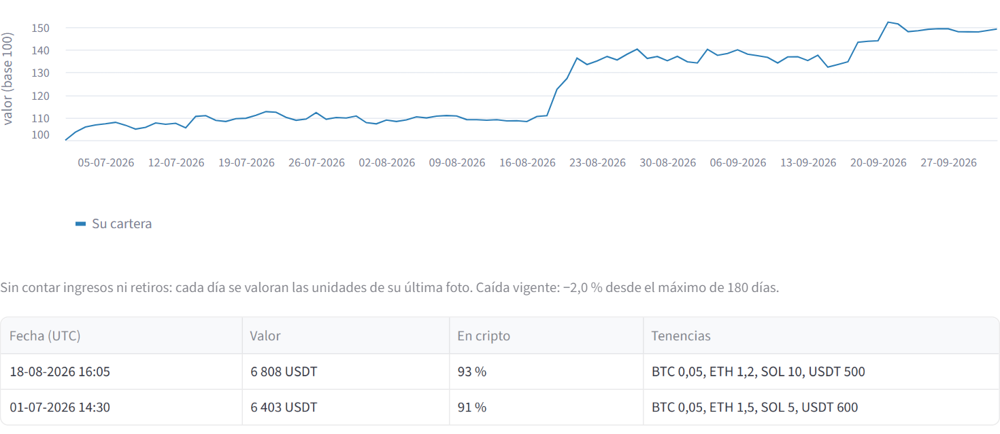

**Cómo funciona.** La regla, el freno y sus límites, explicados en la propia app.

Al usarlo conviene saber tres cosas:

- **Guardar cartera y ajustes** guarda aunque el plan del día no se pueda calcular (por ejemplo, sin
  conexión). El motivo aparece en la página.
- Si el efectivo no alcanza para todas las compras, se recortan a lo que pagan el efectivo y las ventas de
  la misma lista, descontado el coste de estas. Una compra que queda por debajo del mínimo por orden no se
  hace, y su efectivo pasa a las demás.
- En sus gráficos, «Comprar y mantener» es su reparto siempre invertido, rebalanceado cada día y sin
  costes. Con una sola moneda coincide con comprar y mantener.

### El mismo plan en la consola

`python -m cryptoquant piloto --texto` da el plan sin abrir la app. Con la cartera de demostración, unos
minutos después de las capturas:

```text
Piloto de riesgo  (cierres hasta el 2026-09-30 UTC, precios de ahora)
------------------------------------------------------------------------------
  Valor de la cartera   : 9,169.10 USDT
  En cripto ahora       : 94.5%  (8,669.10 USDT)
  Volatilidad prevista  : 43.2% anual de la mezcla (objetivo de la cartera 15%)
  Freno                 : inactivo (caida -1.9%; empieza en -10%)
  Recomendado en cripto : 34.8%  (3,186.77 USDT)

ACCION: pasar a estables 5,482.34 USDT
  Vender        0.03161997 BTC        2,681.36 USDT  a 84,799.54
  Vender        0.75887939 ETH        2,051.96 USDT  a 2,703.94
  Vender        6.32399494 SOL          749.01 USDT  a 118.44

Solo recomienda: las ordenes las decide y ejecuta usted. Guarde la cartera al terminar.
```

El piloto guarda la cartera en `data/piloto/`, que está fuera de git. Su manual completo está en
`cryptoquant/piloto/README.md`, y para usarlo desde el móvil o desde otro equipo, la parte C explica
cómo publicarlo.

## B.6 El sistema completo y la tesis

| Comando | Qué hace |
|---|---|
| `analyze` | Diagnóstico econométrico del universo (estacionariedad, memoria, colas) |
| `pairs` | Pares cointegrados |
| `backtest --compare` | Backtest walk-forward frente a sus variantes, a la pasiva equiponderada (rebalanceada cada día y sin costes) y a comprar y mantener sin rebalancear |
| `recommend --capital 5000` | Reparto recomendado hoy |
| `forward status` / `verify` / `report` / `reproduce` | Estado, integridad y resultados del forward test sellado |
| `tesis` | Contrastes retrospectivos de la tesis y su sensibilidad a dos errores de implementación; la primera vez con `--descargar-historia` |

Todos admiten `-c ruta/config.yaml`, `-v` (más detalle) y `--refresh` (ignorar la caché y descargar de nuevo).
Las tres van antes del comando: `python -m cryptoquant -v forward reproduce --last 0`.

### Reproducir las cifras de la tesis

Con el entorno de `requirements-tesis.txt` (B.1), y en este orden:

1. `python -m cryptoquant tesis` (la primera vez, con red: `--descargar-historia`). Deja todo en
   `reports/tesis/` e imprime la huella de los retornos. Si empieza por `f94f1571d68a`, el modelo tomó las
   mismas decisiones que en la tesis.
2. La réplica en R, desde `laboratorio/r`: `Rscript tesis.R`. Recalcula las 21 variables de los ocho activos
   y las pruebas del VaR con código escrito aparte, y las compara con las de Python. Debe terminar así,
   con ceros en las tres discrepancias:

   ```text
   R 4.6.1
   Variables: 8 activos x 21 variables; dif. maxima relativa 1.28e-10; NA distintos 0
   VaR: 24 combinaciones; excepciones distintas 0; dif. maxima de p-valores 5.86e-15; veredictos distintos 0
   ```

   Compara con lo que encuentre en `reports/tesis/`, así que hay que repetirla cada vez que se repite el
   paso 1.
3. `python -m cryptoquant forward verify` y `python -m cryptoquant forward reproduce --last 0`. El primero
   comprueba que el diario sellado está íntegro, y el segundo, que cada decisión registrada se vuelve a
   calcular igual.

## B.7 Dónde queda cada resultado

| Carpeta | Contenido |
|---|---|
| `data/cache/` | Velas descargadas por el sistema principal (parquet) |
| `data/forward/` | Diario sellado del forward test y su enmienda E1 |
| `data/piloto/` | La cartera real del piloto (fuera de git) |
| `reports/laboratorio/` | Tablas y gráficos del laboratorio; en `r/`, las tablas de su versión en R |
| `reports/riesgo/` | Resultados del módulo de riesgo |
| `reports/tesis/` | Cifras y figuras de la tesis, y la réplica en R (`contraste_r_*.csv`). En `referencia_entorno_2026-09-26/`, la corrida anterior, hecha con otro entorno |
| `laboratorio/r/*.html` | Los R Markdown tejidos (laboratorio y riesgo) |
| `reports/dashboard.html` | El panel |
| `deploy/` | Lo necesario para publicar el piloto en un servidor (parte C) |

## B.8 Configuración

Todos los parámetros que afectan al riesgo están en `config.yaml`. El principal es
`risk.target_volatility` (0.15 = 15 % anual). Otros: `max_weight_per_asset` (tope por activo),
`drawdown_derisk_start` y `max_drawdown_stop` (el freno por caídas) y `data.symbols` (el universo).

## B.9 Copia de trabajo y copia recolectora

Si en la raíz del proyecto existe `COPIA_DE_TRABAJO.txt`, esa copia **no escribe en el diario del
forward test** ni instala la tarea programada: solo la copia del PC lo hace, para que no avancen
dos diarios a la vez.

| Orden | Qué hace |
|---|---|
| `scripts\sincronizar.ps1 -Datos` | Trae del PC lo recolectado: diario sellado, pre-registro, enmiendas, caché de precios, panel y lo nuevo de `investigacion/`. Siempre del PC al USB, nunca al revés |
| `scripts\sincronizar.ps1 -Codigo` | Lleva al PC el código cambiado. Antes pasa las pruebas aquí; después, allí, las pasa de nuevo y recalcula todas las decisiones del diario. Si algo falla, restaura el código anterior |

- El script supone que el USB es la unidad `D:`. Si Windows le asignó otra letra, se indica con
  `-Copia`: `scripts\sincronizar.ps1 -Datos -Copia "E:\Blockchain y criptoactivos"`.
- `-Codigo` no lleva nada si falla alguna prueba, así que el entorno necesita también `pytest`,
  `nbformat` e `ipython` (B.1).
- Llevar código al PC cambia lo que ejecuta el forward test. Si alguna decisión registrada dejara de
  reproducirse, el protocolo exige antes una enmienda.

## B.10 Problemas frecuentes

| Síntoma | Causa | Solución |
|---|---|---|
| HTTP 451 al descargar | `api.binance.com` bloquea servidores de EE. UU. | El programa ya usa `data-api.binance.vision`; en código propio, cambiar la URL |
| El informe dice `synthetic` | No hubo red ni caché real y se usaron series sintéticas | Las cifras no dicen nada del mercado: repetir con conexión |
| `ModuleNotFoundError` | Falta una dependencia o el entorno virtual no está activo | Activar `.venv` y `pip install -r requirements.txt` |
| `No module named 'nbformat'` (o `'IPython'`) al pasar las pruebas | Las pruebas de la clase leen los cuadernos, y esas librerías no están en `requirements.txt` | `pip install pytest nbformat ipython` en el mismo entorno |
| «Falta Streamlit, que la app necesita» | El entorno no tiene la app | La orden que muestra el propio mensaje; mientras tanto, `piloto --texto` |
| La ventana de `piloto.cmd` muestra un error y espera una tecla | El piloto no pudo arrancar | Leer el mensaje: casi siempre es Streamlit (fila anterior) o que falta el entorno de B.1 |
| `tesis` da otra huella y cifras distintas de las de la tesis | Otra versión de Python o de las librerías | Python 3.11.8 con `requirements-tesis.txt` (B.1) |
| `sincronizar.ps1` dice que el USB no está conectado, y sí lo está | El USB tiene otra letra que `D:` | Añadir `-Copia` con la letra correcta (B.9) |
| `Rscript` no se reconoce | R no está en el PATH de Windows | Escribirlo con su ruta completa (B.1) o añadir `C:\Program Files\R\R-4.6.1\bin` al PATH |
| «pandoc version 2.8 or higher is required» al tejer un `.Rmd` desde la terminal | Pandoc viene con RStudio y, fuera de él, R no lo encuentra | Pulsar *Knit* en RStudio o, en PowerShell, antes de `rmarkdown::render`: `$env:RSTUDIO_PANDOC = "C:\Program Files\RStudio\resources\app\bin\quarto\bin\tools"` |
| `tesis.R` se detiene con «Ejecute antes: python -m cryptoquant tesis» | Falta `reports/tesis/variables_tesis.csv` | `python -m cryptoquant tesis` y repetir |
| `laboratorio.Rmd` no muestra la comparación con Python | Falta `reports/laboratorio/variables_diarias.csv` (sin él, R descarga las velas por su cuenta y se salta el contraste) | `python -m cryptoquant laboratorio` y volver a pulsar *Knit* |
| `riesgo.Rmd` se detiene al empezar | Falta `reports/riesgo/estado.json` | `python -m cryptoquant riesgo` |

---

# Parte C · Publicar el piloto en internet (Docker y DigitalOcean)

Con la parte B, el piloto solo se abre en el equipo donde está instalado. Publicado en un servidor
propio, se abre desde cualquier sitio (también el móvil) con su dirección y una contraseña, aunque el
PC esté apagado. Sigue haciendo lo mismo: solo recomienda, no usa claves ni envía órdenes, y de fuera
solo lee los precios públicos de Binance.

## C.1 Cómo queda y cuánto cuesta

- **Un servidor propio:** un *Droplet* de DigitalOcean con Ubuntu 24.04. El plan de 1 GB de memoria
  basta y cuesta unos 6 USD al mes (precio de 2025; compruébelo al crearlo). Las copias de seguridad
  automáticas de DigitalOcean suman un 20 %.
- **Docker** mantiene en marcha dos contenedores: la app y Caddy, que la publica con HTTPS y renueva
  solo el certificado.
- **La cartera** vive en un volumen de Docker del servidor, que se conserva en cada actualización.
- **La dirección:** sin dominio propio, la IP con guiones y `.sslip.io` detrás, por ejemplo
  `https://203-0-113-10.sslip.io`. Con un dominio, la que se elija.

DigitalOcean ofrece también *App Platform*, que publica una app sin administrar un servidor. No sirve
para el piloto: no guarda archivos, y en cada despliegue o reinicio la app perdería la cartera.

## C.2 Lo que hace falta

| Qué | Dónde |
|---|---|
| Una cuenta en DigitalOcean | <https://www.digitalocean.com> (pide una tarjeta) |
| Una clave SSH en este equipo | Ya existe: `C:\Users\ADMIN\.ssh\id_ed25519.pub`. En otro equipo, `ssh-keygen -t ed25519` |
| El entorno del proyecto (B.1) | Calcula la derivada de la contraseña |
| Docker Desktop | Solo para probarlo antes en el PC (C.3) |

## C.3 Probarlo antes en el PC

Con Docker Desktop abierto, desde la raíz del proyecto (el acento grave del final de la primera línea
la continúa en la segunda):

```powershell
docker compose -f deploy/docker-compose.yml -f deploy/docker-compose.local.yml `
  up --build
```

La primera vez construye la imagen (un minuto). La app queda en <http://127.0.0.1:8501>, sin contraseña
porque no sale de este equipo, y se apaga con **Ctrl + C**. Su cartera no es la de `data/piloto/`: vive
en el volumen de Docker.

## C.4 Crear el servidor

En el panel de DigitalOcean, que está en inglés:

1. **Create › Droplets.**
2. **Choose Region:** la más cercana, por ejemplo *New York*.
3. **Choose an image:** *Ubuntu 24.04 (LTS) x64*.
4. **Choose Size:** *Basic*, *Regular* y el plan de 1 GB.
5. **Choose Authentication Method:** *SSH Key* › *New SSH Key*. Pegue la clave pública de este equipo,
   que se copia así:

   ```powershell
   Get-Content $env:USERPROFILE\.ssh\id_ed25519.pub | Set-Clipboard
   ```

6. **Hostname:** `piloto`. Pulse **Create Droplet**.

Al minuto aparece su dirección IP (*ipv4*), por ejemplo `203.0.113.10`.

## C.5 Publicar la app

Desde la raíz del proyecto, en PowerShell:

```powershell
.\scripts\desplegar.ps1 -Servidor 203.0.113.10 -Preparar
```

El script hace todo por SSH, en este orden:

1. **Prepara el servidor** (solo con `-Preparar`, la primera vez): Docker, el cortafuegos (solo SSH, HTTP
   y HTTPS), memoria de intercambio y actualizaciones de seguridad automáticas.
2. **Pide la contraseña** de la app dos veces, de al menos 12 caracteres. No sale del PC: el servidor
   solo recibe su derivada.
3. **Lleva el código,** construye la imagen en el servidor y espera a que la app responda con HTTPS.

Tarda unos cinco minutos y termina así (salida recortada):

```text
Preparando el servidor: Docker, cortafuegos e intercambio (unos minutos)...
Docker version 29.8.2, build 7fc2dff
Elija la clave para entrar a la app. No sale de este equipo: el servidor solo recibe su derivada.
Contraseña del piloto (al menos 12 caracteres):
Repítala:
Construyendo y arrancando la app en el servidor (la primera vez, unos minutos)...
 Container piloto-app-1 Healthy
 Container piloto-caddy-1 Started
NAME             IMAGE        SERVICE   STATUS
piloto-app-1     piloto-app   app       Up 5 seconds (healthy)
piloto-caddy-1   caddy:2      caddy     Up 1 second
Listo: abra https://203-0-113-10.sslip.io y entre con su clave.
```

Si PowerShell responde que la ejecución de scripts está deshabilitada, la misma orden se lanza así:

```powershell
powershell -ExecutionPolicy Bypass -File .\scripts\desplegar.ps1 `
  -Servidor 203.0.113.10 -Preparar
```

## C.6 Entrar

Abra la dirección en el navegador del PC o del móvil. Antes de mostrar nada, el piloto pide la
contraseña:

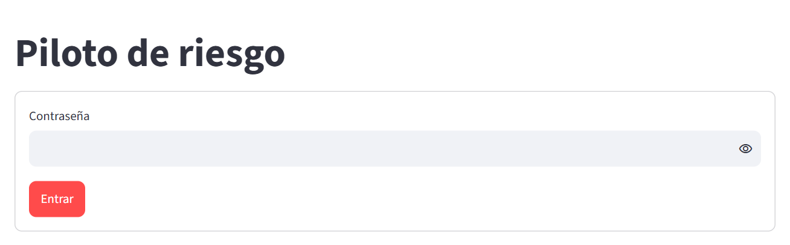

Con la contraseña correcta aparece el piloto de la parte B, vacío la primera vez. Para empezar con la
cartera que ya tiene en el PC, súbala:

```powershell
.\scripts\desplegar.ps1 -Servidor 203.0.113.10 -SubirCartera
```

Antes de sustituirla, el servidor guarda la que tuviera en `/opt/piloto/antes-de-restaurar.tgz`. Desde
entonces, la cartera del servidor y la del PC van por separado: lo que se guarda en una no pasa a la
otra. Conviene usar solo una.

## C.7 El día a día

Todas las órdenes empiezan por `.\scripts\desplegar.ps1 -Servidor 203.0.113.10` (con su IP):

| Para | Añada |
|---|---|
| Llevar al servidor la versión actual del código | nada |
| Traer al PC una copia de la cartera del servidor | `-Respaldar` (queda en `data\piloto\respaldos_servidor\`) |
| Subir al servidor la cartera del PC | `-SubirCartera` |
| Cambiar la contraseña | `-Clave` |
| Usar un dominio propio, tras crear un registro A que apunte a la IP | `-Dominio piloto.midominio.com` |
| Ver los contenedores y las últimas líneas del registro | `-Estado` |

Cada actualización conserva la cartera y solo reconstruye lo que cambió. Para dejar de pagar, haga
antes `-Respaldar` y después borre el Droplet en DigitalOcean (*Destroy*).

## C.8 Seguridad

- **Nada sin contraseña.** La app del servidor no muestra nada sin ella, ni siquiera la barra lateral.
  Cada intento fallido espera 2 segundos y queda en el registro (`-Estado`).
- **HTTPS siempre,** con un certificado de Let's Encrypt que Caddy renueva solo. La app no tiene puertos
  abiertos: solo Caddy escucha, en el 80 y el 443, y el cortafuegos cierra el resto salvo SSH.
- **El servidor no guarda la contraseña,** solo su derivada, en un archivo que únicamente root puede leer.
- **Sin claves de Binance ni órdenes,** igual que en el PC.
- **La cartera vive en un servidor de DigitalOcean.** Haga copias con `-Respaldar`, y no use una
  contraseña que ya use en otro sitio.

## C.9 Si algo falla

| Síntoma | Causa | Solución |
|---|---|---|
| `Permission denied (publickey)` | El Droplet se creó sin la clave SSH de este equipo | Créelo de nuevo eligiendo la clave en el paso 5 de C.4 |
| `REMOTE HOST IDENTIFICATION HAS CHANGED` | Se creó otro Droplet con la misma IP | `ssh-keygen -R 203.0.113.10` y repetir |
| «La app está en marcha, pero … aún no responde con HTTPS» | Caddy no obtuvo el certificado: el dominio no apunta a la IP, o sslip.io agotó su cupo de certificados | Mirar las líneas de `caddy` con `-Estado`. Con un dominio propio, o uno gratuito de DuckDNS (<https://www.duckdns.org>), no hay cupo compartido |
| «Este servidor no tiene contraseña» | No se llegó a fijar | `-Clave` |
| Olvidó la contraseña | — | `-Clave` pone otra; la cartera no se toca |
| «Binance solo dio velas hasta el …» | Binance no respondió del todo desde el servidor | *Actualizar precios* más tarde; si sigue, `-Estado` |
